# 实验记录与消融

本文件整理项目中保留下来的中间实验结果。最终主结果见 `README.md` 和 `REPORT.md`；这里主要记录“源域增强模型”和“应用层后处理”的对比实验。

## 1. 源域增强基线

在源域上使用离线显微图像增强，并切换到 YOLO11s、`imgsz=960` 后，目标域表现明显优于早期 YOLOv8n baseline。

| 实验 | 验证集 | AP50 injection | AP50 holding | AP50 oocyte | mAP50 | mAP50-95 |
| --- | --- | ---: | ---: | ---: | ---: | ---: |
| Source plain YOLOv8n | target_eval | 0.2474 | 0.2258 | 0.0788 | 0.1840 | 0.0901 |
| YOLO11s + source augmentation | target_eval | 0.6938 | 0.6574 | 0.9608 | 0.7707 | 0.4842 |
| YOLO11s + source augmentation | full SCNT-Target | 0.6616 | 0.6448 | 0.9499 | 0.7521 | 0.4864 |

增强包含目标尺度扰动、橙色/暖色背景风格扰动、较温和的 HSV 变化和小目标相关增强。该方法属于域泛化增强，不使用目标域真实标签。

## 2. 应用层后处理

后处理不是重新训练模型，而是在应用推理阶段加入形态规则，用来缓解 holding needle 与 injection needle 的混淆，以及过滤过大的 oocyte 误检。

主要规则：

- 如果模型预测为 `injection_needle`，但框高度较大、长宽比不够细长、面积较大，则将其重标为 `holding_needle`。
- 如果模型预测为 `oocyte`，但框面积或边长异常过大，则过滤该框。

相关脚本：

```text
scripts/eval_postprocess.py
scripts/predict_visualize.py
```

注意：该实验使用自定义 evaluator，并固定 `conf=0.25`。因此它适合比较 raw 与 postprocess 的相对变化，但不要和 Ultralytics 官方 `model.val()` 指标直接混为同一张表。

## 3. 后处理结果

### 严格 target_eval 划分

文件：

```text
docs/results/postprocess_eval_yolo11s_strict_target_eval_conf025.csv
```

| Mode | AP50 injection | AP50 holding | AP50 oocyte | mAP50 | mAP50-95 |
| --- | ---: | ---: | ---: | ---: | ---: |
| raw | 0.4461 | 0.1043 | 0.9037 | 0.4847 | 0.3160 |
| postprocess | 0.5320 | 0.5372 | 0.9001 | 0.6564 | 0.4424 |

在该设置下，holding needle AP50 从 `0.1043` 提升到 `0.5372`，说明形态后处理对 holding/injection 混淆有明显帮助。

### 全 SCNT-Target

文件：

```text
docs/results/postprocess_eval_yolo11s_all_target_conf025.csv
```

| Mode | AP50 injection | AP50 holding | AP50 oocyte | mAP50 | mAP50-95 |
| --- | ---: | ---: | ---: | ---: | ---: |
| raw | 0.3904 | 0.0784 | 0.9145 | 0.4611 | 0.3119 |
| postprocess | 0.4592 | 0.4987 | 0.9122 | 0.6234 | 0.4351 |

在全目标域上，holding needle AP50 从 `0.0784` 提升到 `0.4987`，mAP50 从 `0.4611` 提升到 `0.6234`。

## 4. 结果解释

该结果说明：当训练数据中 holding needle 的形态分布不足时，模型容易把宽、粗、低长宽比的 holding needle 误识别为 injection needle。应用层后处理可以利用形态特征纠正一部分错误，但它不是纯端到端学习方法，也不能解决漏检问题。

因此，后处理适合作为工程应用的辅助策略；最终模型能力提升仍然依赖更好的训练数据。本项目最终采用 50 张目标域人工精标样本重新训练，取得了更稳定的结果。

## 5. 代表性可视化

为避免仓库体积过大，这里只保留少量代表性预测图。完整可视化结果可在本地通过脚本重新生成。

### 源域增强模型：原始预测与后处理

| 原始预测 | 后处理 |
| --- | --- |
| 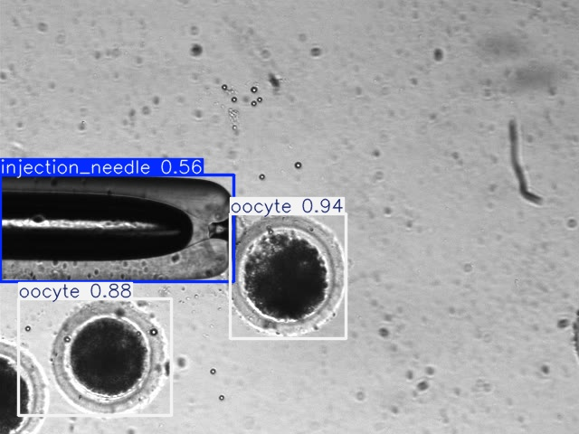 | 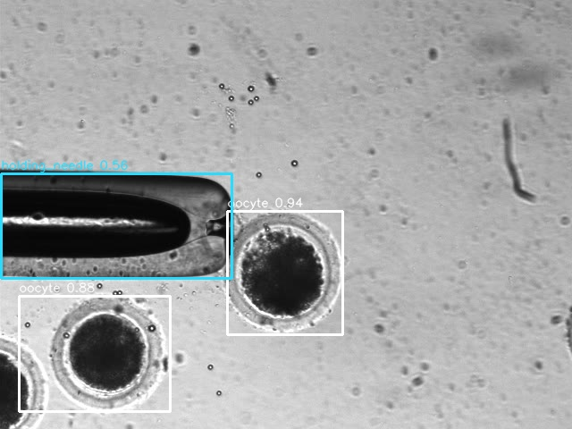 |
| 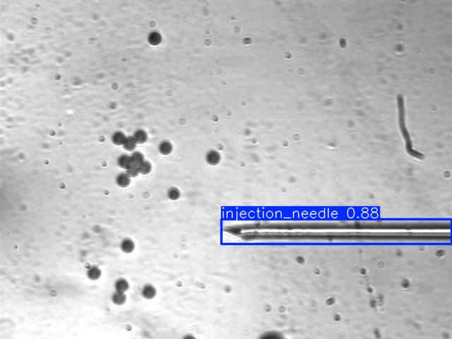 | 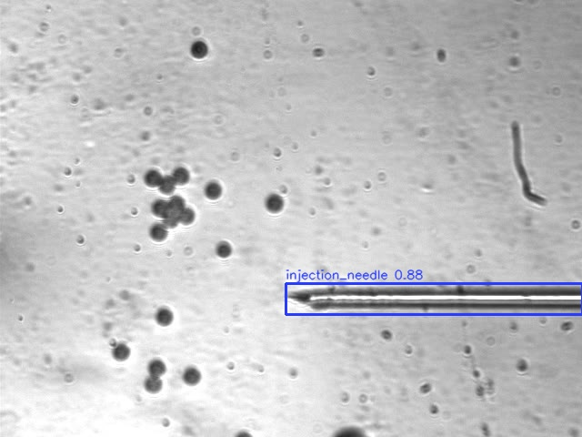 |
| 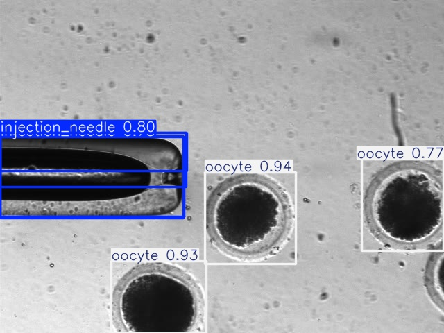 | 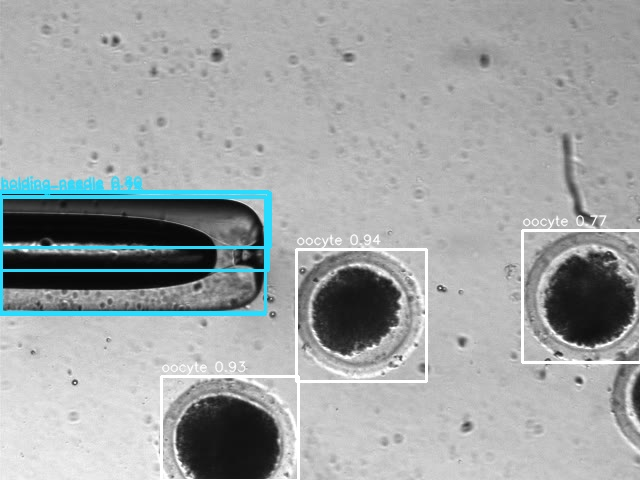 |

### 密集卵细胞和小目标样例

| 原始预测 | 后处理 |
| --- | --- |
| 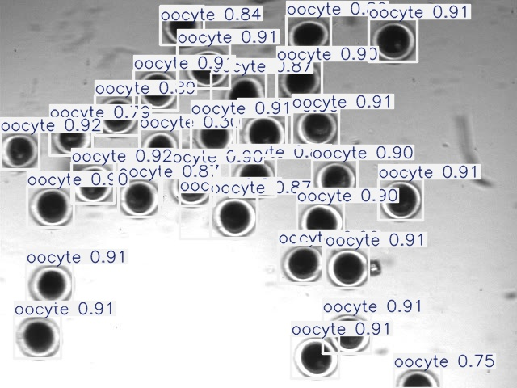 | 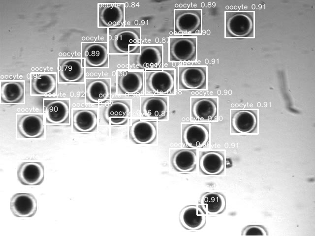 |
| 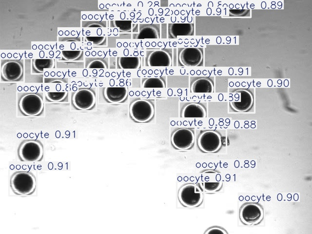 | 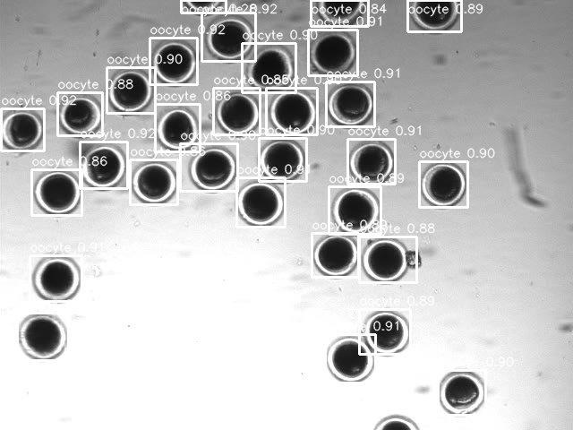 |
| 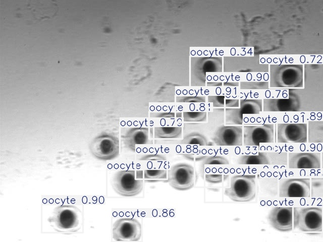 | 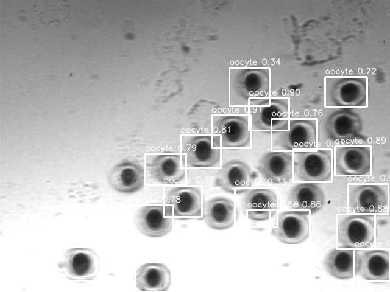 |

### 最终 Manual-50 模型样例

| 样例 | 可视化 |
| --- | --- |
| 针和卵细胞混合场景 | 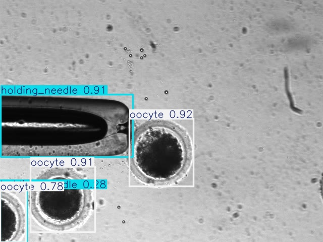 |
| 针体和小噪声目标 |  |
| 密集卵细胞场景 | 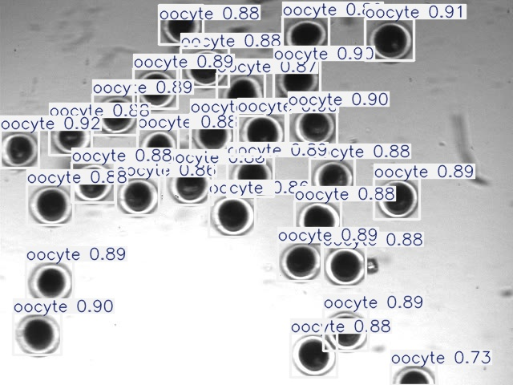 |

## 6. 复现命令

评估 source augmentation + 后处理：

```powershell
python scripts/eval_postprocess.py --model runs/scnt/source_aug_yolo11s_compact_smallobj_960/weights/best.pt --data configs/scnt_source.yaml --predict-conf 0.25 --imgsz 960 --batch 1 --device 0 --output-csv outputs/postprocess_eval_yolo11s_strict_target_eval_conf025.csv
```

在全目标域上评估：

```powershell
python scripts/eval_postprocess.py --model runs/scnt/source_aug_yolo11s_compact_smallobj_960/weights/best.pt --data configs/scnt_target_all_val.yaml --predict-conf 0.25 --imgsz 960 --batch 1 --device 0 --output-csv outputs/postprocess_eval_yolo11s_all_target_conf025.csv
```

生成全目标域后处理可视化：

```powershell
python scripts/predict_visualize.py --model runs/scnt/source_aug_yolo11s_compact_smallobj_960/weights/best.pt --source dataset/SCNT/SCNT-Target/images --output outputs/visualizations/yolo11s_all_target_postprocess_all --max-images 0 --conf 0.25 --imgsz 960 --batch 1 --rect --device 0 --needle-morphology-relabel --filter-oocyte-size --exist-ok --quiet
```

## 7. 为什么没有作为最终主方案

后处理能有效缓解 holding/injection 的类别混淆，但它依赖人工规则，泛化性取决于目标场景是否符合这些形态假设。为了得到更稳健的模型，本项目最终选择用少量目标域人工精标数据构建训练闭环，并在 479 张独立 final_eval 上验证。
